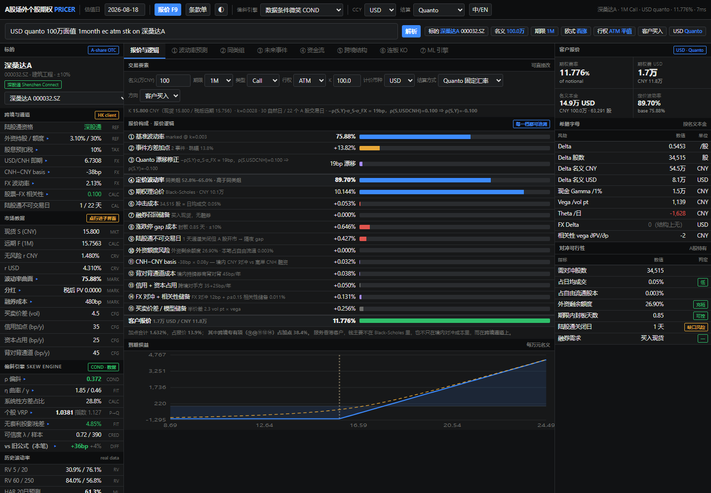

# A-Share OTC Option Pricing Skill

A Codex skill and transparent demo for explaining and sanity-checking indicative A-share OTC equity-option quotes.

这是一个可直接使用的 Codex Skill 和透明定价 demo，用来解释、演示和检查 A 股场外个股期权的 indicative 报价。中文逐步说明见 [references/pricing-workflow.zh-CN.md](references/pricing-workflow.zh-CN.md)。



## Online demos

- **Full original dealer-style demo:** [GitHub Pages](https://lancewang1.github.io/a-share-otc-option-pricing-skill/)
- **Simplified transparent demo:** [simple.html](https://lancewang1.github.io/a-share-otc-option-pricing-skill/simple.html)

The full demo is published with the repository owner's explicit authorization. It contains embedded per-stock derived data and model parameters from the supplied original HTML and remains `INDICATIVE`.

The source material describes a larger dealer-style system with volatility-surface construction, a conditional-volatility engine, an ML challenger, local-volatility/Monte Carlo components, cross-currency settlement, Greeks, and a commercial quote waterfall. This public package keeps the reusable methodology and an inspectable vanilla-option demo. It intentionally excludes proprietary observations, per-stock calibrations, trained weights, and internal research artifacts.

## What it does

- Builds a forward from spot, discounted cash dividends, the risk-free rate, and stock borrow.
- Converts that forward to a Black-Scholes-compatible continuous yield.
- Prices European calls and puts and reports Delta, Gamma, Vega, daily Theta, and Rho.
- Demonstrates local, quanto, and composite settlement adjustments.
- Separates theoretical price from simplified commercial reserves.
- Checks put-call parity and basic input invariants.
- Documents the full source-system workflow and its model risks.

## Run it

Open `assets/demo.html` directly in a browser, or run:

```bash
python scripts/price_demo.py
python scripts/price_demo.py --help
python -m unittest discover -s tests -v
```

For Codex, install or reference this folder as `$a-share-otc-option-pricing`. Detailed model flow is in [references/pricing-workflow.md](references/pricing-workflow.md); review controls are in [references/model-risk.md](references/model-risk.md).

## Scope

Outputs are educational and `INDICATIVE`. The demo uses user-entered assumptions, not live market data. It is not suitable for execution, valuation statements, accounting, margin, or risk-limit decisions without governed data, independently validated models, and operational controls.
